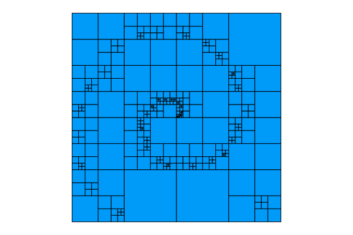
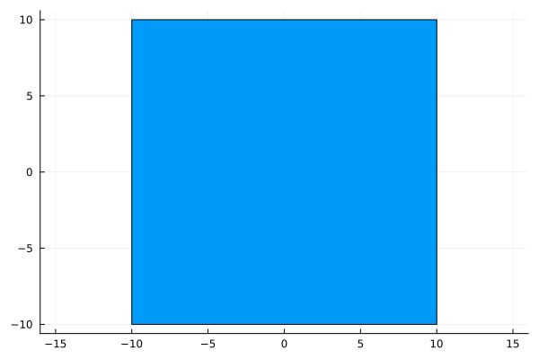
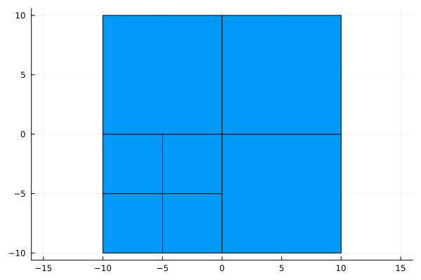
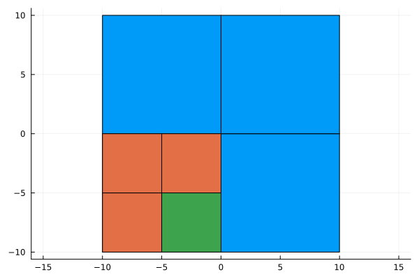
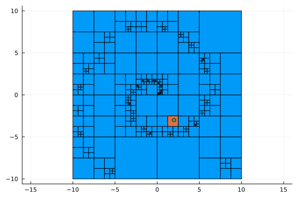

# Block Refined Grids

[](https://github.com/lmejn/BlockRefinedGrid.jl/actions/workflows/CI.yml?query=branch%3Amain)

A small package for creating block refined grids.



## Usage

A grid is defined by a single `GridCell`, which stores the `origin`, `width` and `children` of the cell.
To demonstrate, we will use 2D grids.

Start off by creating one grid cell:
```julia
cell = GridCell([-10., -10.], [20., 20.])
```


We can refine the cell, which splits the cell in half, creating two more cells in 1D:
```julia
refine!(cell)
```
In this figure, the grid is refined twice.



The cell can also be coarsened, which removes all subcells in `cell`:
```julia
coarsen!(cell)
```


Cells can be indexed as well.
This returns the first subcell of the 2nd subcell of the first subcell of the root cell:
```julia
cell[1, 2]
```
Orange shows `cell[1]` and green shows `cell[1, 2]`:



Cells can also be located by position.
This returns the cell containing position `x`:
```julia
x = [2., -3.]
findcell(cell, x)
```
The green position is within the orange cell:



This functionality is combined with refinement which allows you to refine a cell at a position `x`:
```julia
x = [2., -3.]
refine!(cell, x)
```
The orange cell containing the green position has been refined:


